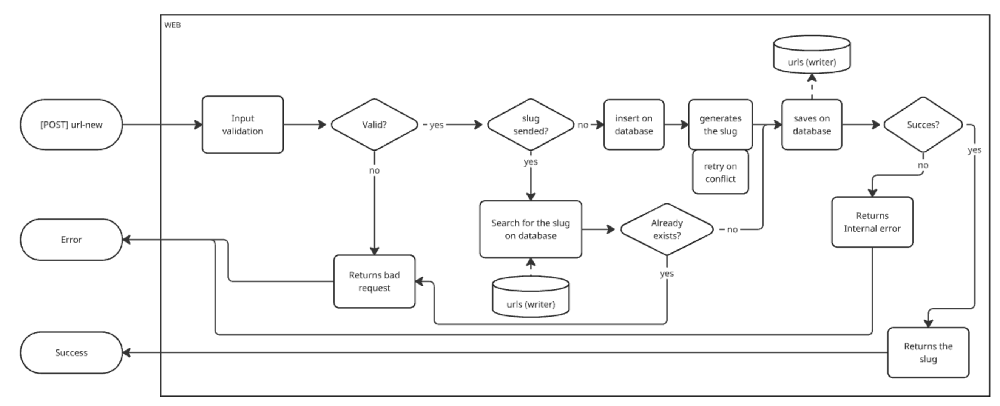
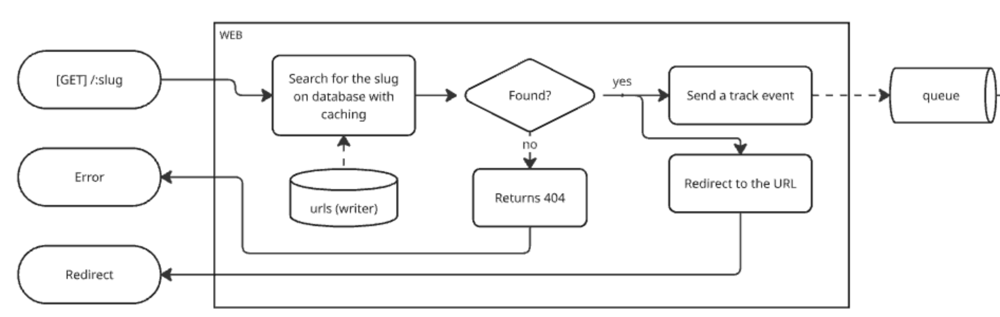
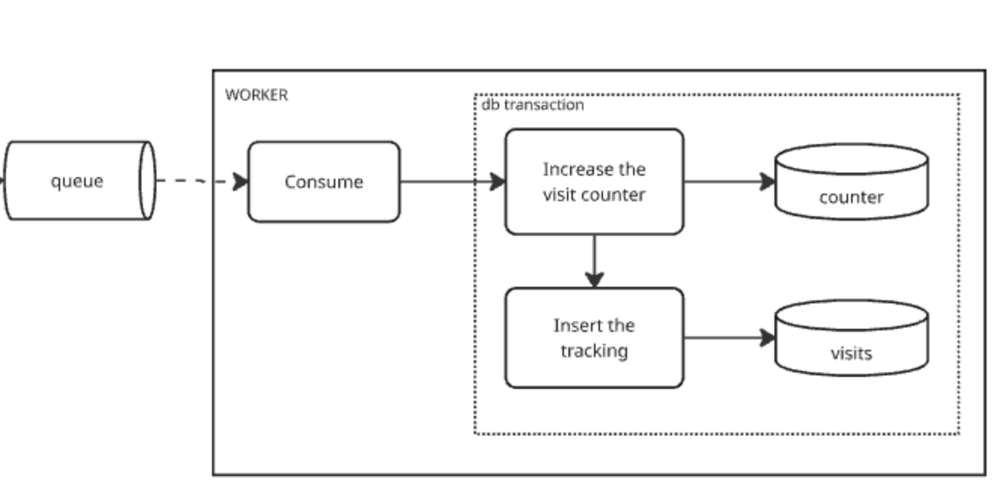
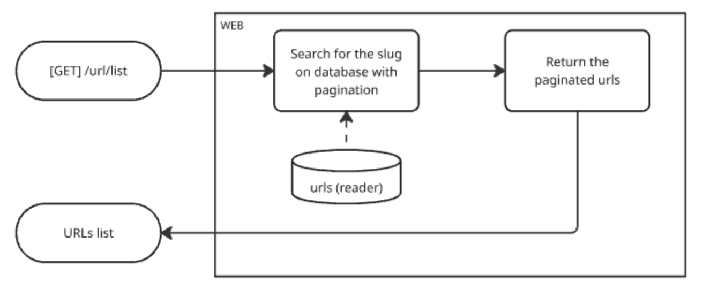
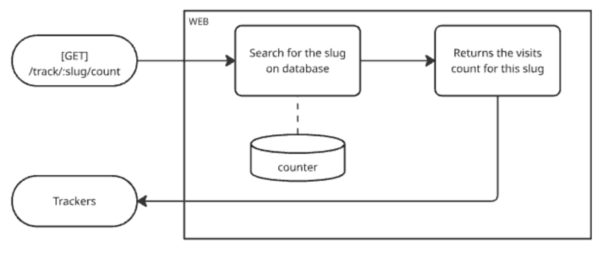
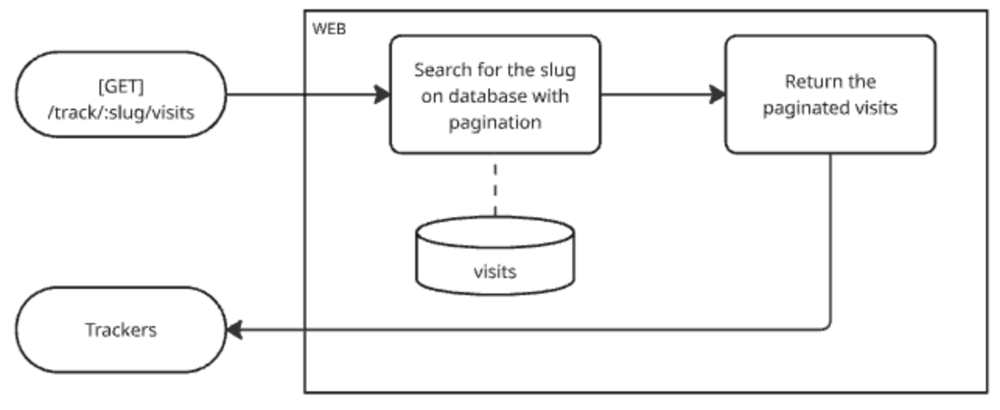

# Dk's URL Shortener

A simple URL shortener application with a NestJS backend and React frontend.

## Prerequisites

- Docker
- Docker Compose

## Getting Started

1. Clone the repository:
```bash
git clone <repository-url>
cd url-shortener
```

2. Start the services:
```bash
docker compose up -d
```

## Services and Ports

The following services are available at these ports:

- Frontend: http://localhost:5173 (React application)
- API: http://localhost:3033/api (Swagger for the NestJS backend)
- PostgreSQL: localhost:3458
- Redis: localhost:3459
- Redis Commander: http://localhost:3460 (Redis management interface)

## Development

The application is set up with hot-reload for both frontend and backend:

- Frontend changes will be reflected immediately in the browser
- Backend changes will trigger automatic rebuilds

## Environment Variables

The following environment variables are available:

### Frontend
- `VITE_API_URL`: URL of the API service (automatically set in Docker)

### Backend
- `DATABASE_URL`: PostgreSQL connection string
- `MAX_RETRIES`: Maximum number of retries for database operations
- `REDIS_HOST`: Redis host
- `REDIS_PORT`: Redis port

## Stopping the Services

To stop all services:
```bash
docker compose down
```

To stop and remove volumes:
```bash
docker compose down -v
```

---

## Features and Implementation Details

### URL Shortening


The URL shortening process follows these steps:

1. **Input Validation**: Validates the input URL and optional custom slug
2. **Slug Handling**:
   - If a custom slug is provided, checks for existing conflicts
   - If no slug is provided, generates a unique one
3. **Storage**:
   - Saves the URL and slug in the database
4. **Response**: Returns the generated/provided slug

Implementation highlights:
- Supports custom slugs with collision detection
- Associates URLs with users when authenticated
- Implements retry mechanism for slug generation on conflicts

### URL Redirection


The redirection process includes:

1. **Slug Lookup**:
   - First checks Redis cache for the URL
   - Falls back to database if not in cache and store the url at the cache
2. **Visit Tracking**:
   - Sends a tracking event to the queue
   - Asynchronously processes visit data
3. **Redirection**:
   - Returns 404 if URL not found
   - Redirects to original URL if found

Implementation highlights:
- Implements caching strategy for fast redirects
- Asynchronous tracking to minimize redirect latency
- Handles user agent and referrer information

### Visit Tracking


The tracking system processes visits asynchronously:

1. **Queue Processing**:
   - Consumes tracking events from the queue
2. **Database Transaction**:
   - Updates visit counter atomically
   - Stores visit details (user agent, referrer, etc.)

Implementation highlights:
- Uses Bull queue for reliable event processing
- Implements transactional updates
- Stores detailed visit information for analytics

### URL Management


Users can manage their shortened URLs through:

1. **Paginated List**:
   - Shows all URLs created by the user
   - Implements efficient pagination
2. **URL Details**:
   - Original URL
   - Creation date
   - Usage statistics

Implementation highlights:
- Uses read replica for list queries
- Implements cursor-based pagination
- Optimized for performance with large datasets

### Analytics
The system provides two types of analytics:

#### Visit Counter


Provides quick access to total visit counts:
- Efficient counter implementation
- Real-time updates
- Cached results

#### Visit Details


Detailed visit information including:
- Timestamp
- User agent
- Referrer
- Geographic location (if available)
- Paginated results for efficient retrieval

Implementation highlights:
- Separate endpoints for count and details
- Optimized for different use cases
- Supports filtering and sorting